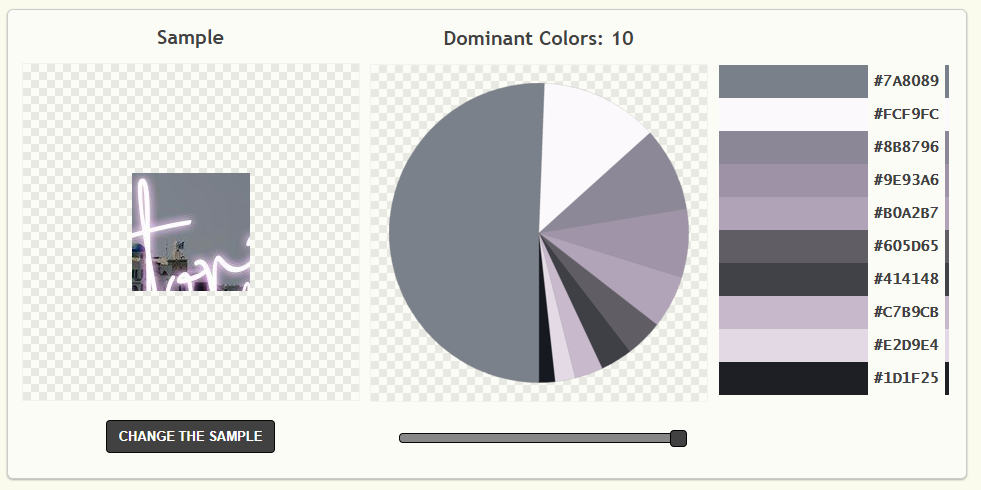

# Santorini Nail Bar

### Introduction and Purpose

I am developing this website as my MS1 project (Code Institute's Dimploma in Software Development) and for the owner, with a focus on providing the users with information about her service via her portfolio in a gallery and specifically for them to easily make and manage their own appointments independently, from within the site itself. The business goal is to free the owner up to concentrate her time solely (as far as is reasonably possible) on the clients in front of her rather than the administrative aspect of her business. This site is a *work in progress* that will be updated with new content added and/or removed when necessary and appropriate.


##### UX

**As an existing cient, I want to be able to see what appointment days/times are available and choose to suit my schedule. I don't want to have to wait or call to make an appointment and I prefer to book a regular spot so they I can plan around my schedule.** 

The booking button allows this type of user to do this effectively the moment they open the webpage up. Also an existing user I might want to ask the nail technician about something and the contact form provides them with contact information and a contact form to do this quickly and easily.

**As a potential client, I am looking to find a nail bar near me that is recommended by others. I want to see for myself what to expect from my nail treatment in respect of quality and trend. As I haven't met the nail technican yet, I am looking to see if I will like the mail technician and whether I think I will be able to establish rapport with them before I make an appointment.**

This type of user can achieve all this because the site shows a sample of the nail bar owners portfolio in the gallery which shows genuine samples of work done and the testimonials give verifiable recommendations as they mention where they were made and as the social media links are in the footer they can go directly there.

The about section provides this user with a feel for the nail technicians personality so they decide whether they feel comfortable before actually making an appointment. If so, they can go ahead and make a booking using the button located above the contact section. If this user still wishes to find out something else frst, they can ask using the contact form, which also lets them know the form as been received with a submit notification. In addition, they can also use the calendar icon in the footer button. As the navigation is sticky they can easily navigate back to the gallery or the home section where there is another booking button. 

**I am a user that offers a complimentary service and I would like to find a nail bar that would be interested in joining forces with me.** 

The website makes it easy for this user to connect with the owner or make a request by using the contact section and/or form and to connect on social media using the footer icons.


Since the audience is expected to be of varying ability and need, albeit mostly tech savvy, my aim in the design was simplicity, creating an intuitive site that provides easy access to their main purpose - the information or feature the user is looking for. I have made the sections visually distinguishable and separate from each other using a colour palette generated from a portion of the header (logo) image using [PaletteGenerator](https://palettegenerator.com/). 
  

The colours are light where necessary and dark where possible to blend with the header image logo. I have been concerned primarily with making the booking buttons stand out and seem obvious for visually impaired users because I wanted to create a soft appearance created by the use of colour. I also tried to avoid the need for too much scrolling to reach the highest priority content for each user type. The navigation position is sticky so that it is always in view making it easy to go somewhere else; to the top, or a different section.

The fonts chosen for this site were taken from [Google Fonts](https://fonts.google.com/). They were selected as they are simple, clear and easy to read and quick to load.

For users that may not necessarily be wanting to make an appointment on their first visit but are instead looking for credibility or out of curiosity, I have added three sections. A **Testimonials** section; set as a blockquote card carousel on a mobile device but as a card column on a tablet and desktop. An **About** section introduces the owner. This section gives credibilty and presents the owners capability and qualifications in an understated manner while emphasising her passion in her work and finally, a **Contact** section with a contact form along with contact information. I mention here that although I could have added a map, I resisted doing so from a safety perspective as this I consider to be sensitive information for a home-based business.

Throughout the development I have switched up and down screen sizes using Chrome dev tools to see how I can improve the user experience, based on a mobile-first approach. The owner believes that a large portion of her users are likely to access the site mostly on a mobile device for the purpose of easily booking an appointment and to browse the gallery for ideas; however as many people use desktops at work, the potential was also considered for users to access it during working hours. 

The most obvious thing a user will see first on their mobile is a booking button, as the 'welcome' message appears only on medium size screens and above. The button will take the user to the owners [Setmore](https://www.setmore.com/) scheduling account opening up in a new browser window.


#### Features

##### News banner
This was something that was requested in order to inform the users of current events. When there is nothing significant to broadcast the text will be removed but the row and styling will remain for the purpose of maintaining balance around the ```header``` image.

##### Navigation
The bootstrap navbar is collapsible to a hamburger menu icon on small devices and expands on medium screens as per the brief from the owner. It is positioned on the left as a matter of preference.

##### Online appointment scheduling
Apart from acting as a business card and marketing site, the most advantageous feature to implement was the online appointment bookings. Within the options that I found that were free, is a widget by [Setmore](https://setmore.com) that could be added to the website. [Setmore](https://setmore.com) has a basic version that provides sufficient functionality resulting in the users being empowered to book their own appointments 24/7. Once the free version no longer adequately meets the business and/or owners needs, it can be scaled up to a paid version; however, the free version also allows for up to four staff logins so may remain suitable for the foreeable future. In addition, I want to make mention of the notifications feature included in the free version, which took care of an item previously listed under the future features section of this document.

##### Bootstrap Carousel
This was the most ideal way for the owners portfolio of work to be presented and for the testimonials to be displayed on a small screen to avoid taking up too much real estate on the site. Again, it allows for upscaling with minimum changes.


##### New Client in-take form
Due to the varying user capabilities it was necessary for this form to be inclusive. As an external link it can be completed online and is automatically sent to the owner. It was not a necessity from the owners perspective but a nice time saver that was easily incorporated. The download button is found at the bottom of the page in the footer due to its low importance. The form is not obligatory but can be used to save time on a first appointment. A tooltip provides the user with more information on it's purpose.

##### Favicon
This has been moved from the Future planned features to Features as one was designed for the website for me. I really felt that it was something important when this website was the only tab without it in a window full of open tabs. This is the web browser favicon , and this is linked in the ```head``` to apple-touch for dragging to the homescreen of an iphone. . This feature increases the brand identity and credibility.

##### Contact form
The contact form allows a user to request some information that is not currently available on the site. As soon as a verified form has been submitted successfully, an email notification get sent to the email address configured.


#### Features Left to Implement in the future.

In stretch 2, I would like to improve the way the gallery is displayed. Possibly with the images fading in rather than sliding and with curved corners. I did make an attempt to round the corners of the imaages but at this stage I lack the necessary knowledge.

I would also like to add a modal. After a period of inctivity the modal will appear prompting the user to book an appointment. I feel this is something that needs some research with regards to the delay time in order not to annoy the users. I will mostly likely use Bootstrap for this.

FAQ's. A nice to have fetaure for future implementation. Once the owner has a collection of questions substantial enough to warrant the time, this feature can be added.

##### Future feature ideas will be added here as they come up.

In the future, as the content and business grows, the site should be split into individual pages so that additional pages can be added, such as a Products page. The owner is planning her own line of products that she will advertise and sell from her site. Shopify and PayPal are the technologies that are currently drafted into the plans for this.

#### Technologies used
1. HTML5
2. [Bootstrap4](https://getbootstrap.com) for the grid layout, components and styling 
3. CSS3 - for unique styling measures.
4. [Git](https://git-scm.com/) for version control.
5. [GitHub](https://github.com/) for the repository to store the files.
6. [GitHub Pages](https://pages.github.com/) to deploy the site.
7. [Netify](https://www.netlify.com/) to deploy the site.

#### Testing

In order to ensure the site works as intended, I have conducted the following manual tests on phones, tablets and desktops, using Chrome, Safari, Firefox, Internet Explorer, Edge and Opera. I enlisted the help of several people using different devices than I, so that I had a reasonable sample. I believe the best result in respect of speed in every case was from Chrome and Google. Safari and Firefox were much slower to load and with Opera mini, the contact section only downloaded fully after using the navigation link, whereafter it was instantaneous.

1. Features

    The features display and function as intended on small, medium and large devices.

2. Links

    All the button links have been tested to go to the expected destination and open in a new brower tab and avoid the need for the browser back button.

3. Footer icons.

    A tooltip pops up on hover and the links open into a new browser tab when clicked.

4. Navigation

    The navbar remains in the desired ```position: sticky;``` ```top: 0;``` when scrolling and the links take the user to the expected section of the page. This was important for a single scrolling page and in order to achieve this I needed to remove the ```<nav>``` from the ```<header>``` and place it just beneath.

5. Contact

    The contact form requires input validation. The bot-field works and a success notifcation is displayed on submit. An email is sent to the owner on each valid form submission. I originally had a recaptcha 2 challenge but as this wasn't working I replaced it with the hidden bot-field as a measure of spam protection.  In order to test the bot-field I temporarily replaced the ```visibility: hidden``` to```visibility: visible```. During this phase, I decided to reposition the submit button so that the form layout wasn't affected. By placing the submit button inside a 2 column row so that they were adjacent to eachother, I could remove the bottom margin that I had initially used to create space beneath the button. I will continue to address the issue of the recptacha challenge and try and find a solution or cause.

As I have used the Bootstrap frame work which has automatically provided me with breakpoints for responsiveness, I used Chrome developer tools to test the various screen resolutions. However, I was able to get the site tested on a 5k resolution and was sent a screencast, which I found to be quite disappointing. Revisiting the user stories, I have decided not to spend any time on resolving this issue at present as the target market is highly unlikely to be viewing the site on such a large screen. The result though, was that the logo image only filled 60% of the screen (very fixable as I reduced the size considerably), the text was extemely small and the footer did not stick to the bottom even though I have used the html footer element. I intend to find out how to render the content to fill the viewport height and width in stretch 2 once my project has been assessed, as a learning opportunity. I am speculating at this point that this is something to do wwith the browser preventing a compromise on quality but it will be an interesting discovery to make. I did see whether making the footer fixed would work but found that it took up to much of the screen with both the navigation and footer fixed so that isn't a suitable solution.

Owners feedback on testing her deployed site:
>   "I have tested the link for the live website and I am very happy overall. I prefer the gallery as it is rather than as we originally planned it.  The testimonals are much better as a slide show on a phone as they originally took up too much space being one beneath the other.  I did notice that the header image loads quite slowly but that could be my slow internet. I tried all of the buttons and everything that can be clicked and it all worked perfectly and everything loaded onto the page. I used Safari, Firefox and Chrome on a macbook and iphone 8. The extra things like the icon in the browser that have been added are awesome."

Based on feedback that I received I compressed the ```<header>``` hero image using [TinyJPG](https://tinyjpg.com/) and I spent an enormous amount of time trying to adjust the testimonial cards to equal height using css. I found that in a responsive layout it was better to allow the ```flex: 1 1 auto``` rules to apply even though it doesn't give the best user experience being of unequal height. Perhaps in the future this will be something I will manage but for the sake of not running out of time I had to accept and settle.

I also added padding above the bio text to balance with the lead text of the gallery.

I used [W3C Markup Validation Service](https://validator.w3.org/) to check my html code. The errors I could not reslolve were related to my contact form. 

    Error: Attribute netlify-honeypot not allowed on element form at this point.
    Error: Attribute netlify not allowed on element form at this point.
    
However, these attributes come directly from the Netify documentation and without them the form will not work.

<p>
<a href="http://jigsaw.w3.org/css-validator/check/referer">
    
    </a>
</p>

#### Deployment
The site is deployed on GitHub pages as well as Netlify (via GitHub) from the master branch and will update automatically upon new commits. They can be accessed via https://sph73.github.io/Santorini-nail-bar/ and https://santorininailsofficial.netlify.com/ The reason, I have used different names is to avoid confusion at a later date once the owner has her site hosted on Netlify as a custom domain. *Please note that the contact form will only work when accessing the site via the netlify link.*

 
#### Credits
I have used the documentation and/or tutorials in [Bootstrap4](https://getbootstrap.com/docs/), [W3C](https://www.w3.org/) and [Netlify](https://www.netlify.com/docs/) in order to produce this site as well the mini-project and resume project from the Full Stack Web Development Course from Code Institute.

The footer icons in the resume project I really liked and felt that they fitted the site well with small modifications to the color theme and size only.

The alert banner from the mini-project gave me the idea for the news banner for this site however, I wrote the code myself using bootstrap classes and CSS.

**The header image artwork and Favicon** was created by BackToBack Solutions.

**The New Client In-take Form** was created by the owner of the website using [Google Forms by Google Cloud](https://gsuite.google.com/products/forms/) and it was just a matter of adding the link I was sent.

##### Media
**The gallery** was taken from the owners portfolio of work.

##### Testimonials
**The testimonials** are extracted from the owners Facebook page - [Santorini Nail Bar](https://www.facebook.com/SantoriniNailBar/)

##### About 
**The Bio** was written by me as I feel confident that I am knowledgable enough of the owners progression in her career, considering that she is my daughter.
 
##### Contact
**The contact form** utilises [Netlify's](https://www.netlify.com/docs/form-handling/) built-in form handling . On the free plan there is a monthly allowance of 100 submissions per month which is currently more than adequate.


#### Acknowledgements

I was inspred to develop this project as I have a young daughter, Samantha Salamon, who has just completed her Diploma in Somatoloogy and who already has other certifications in the beauty industry. Aware of the fact that she had aspirations to be self-employed with a work-from-home small business, proven through the actions she has already taken, my own desire was fueled to assist her with a website that would assist her by reducing the workload and stress that a business would place on her. Her strengths are her artistic creativity and her weakeness (by her own admission) is the administrative function. Moreover, it is difficult to take calls and bookings whilst actively working on a clients nails. As much as I am able, I wish to remove this challenge for her by placing the relevant features within her own website. 

When I broached the subject of making her a website for my Milestone 1 Project, she was extremely enthusiastic and has been reviewing the project development throughout, so I feel this has been a collaborative effort between us and deserves mentioning.


##### Copyright
I have added a copyright notice in the footer as the site and all the content belongs to Samantha Salamon and the images present her portfolio of work.

The original wireframes can be view [here](wireframes).

